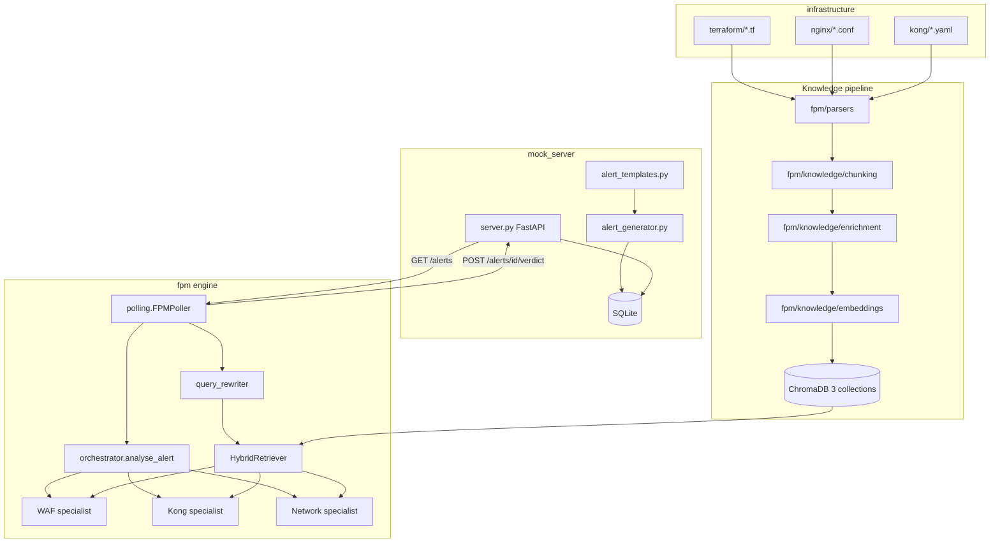
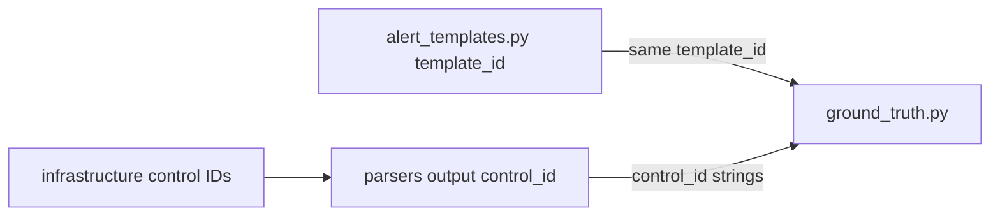

# FPM system architecture

Two cooperating applications under `FPM/`: a **Traceable Mock Server** (alert source) and the **False Positive Minimizer** (AI analysis engine).

## System context

| Application | Port | Package | Purpose |
|-------------|------|---------|---------|
| Traceable Mock Server | 8000 | `mock_server/` | Generate/store alerts, REST API, dashboard |
| False Positive Minimizer | — (polls 8000) | `fpm/` | KB build, hybrid retrieval, multi-agent verdicts |

The FPM does not receive alerts via push; it **polls** the mock server on an interval (`FPM_POLL_INTERVAL_SECONDS`, default 30s).

## End-to-end data flow



## REST API contract (mock server)

Base URL: `TRACEABLE_BASE_URL` (default `http://localhost:8000`).

| Method | Path | Purpose |
|--------|------|---------|
| `GET` | `/health` | Health check |
| `GET` | `/alerts` | **Pending** alerts only — FPM poller input |
| `GET` | `/alerts/all` | All alerts regardless of status |
| `GET` | `/alerts/stats` | Summary statistics |
| `POST` | `/alerts/{alert_id}/verdict` | FPM posts analysis result |
| `GET` | `/` | HTML monitoring dashboard |

### Verdict payload (`POST /alerts/{alert_id}/verdict`)

Required fields (see `VerdictRequest` in `mock_server/server.py`):

| Field | Type | Notes |
|-------|------|-------|
| `verdict` | string | One of: `TRUE_POSITIVE`, `FALSE_POSITIVE`, `PARTIAL_RISK`, `NEEDS_HUMAN_REVIEW` |
| `confidence` | float | 0.0–1.0 |
| `reasoning` | string | Human-readable explanation |
| `controls_found` | string[] | Control IDs cited |
| `coverage_gaps` | string[] | Optional |
| `recommended_action` | string | Optional |
| `tokens_used` | int | Optional |
| `analysis_latency_ms` | int | Optional |

Responses: `404` if alert missing; `409` if alert already `analysed` (poller treats 409 as skip).

## Knowledge pipeline

**Entry:** `build_knowledge_base(openai_client)` in `fpm/knowledge/builder.py`.

1. **Parse** configs under `infrastructure/`:
   - `terraform/*.tf` → `terraform_parser.parse_terraform`
   - `nginx/*.conf` → `nginx_parser` or `modsecurity_parser` (if filename contains `modsecurity`)
   - `kong/*.{yaml,yml}` → `kong_parser.parse_kong`
2. **Chunk** (three strategies, separate Chroma collections):
   - `chunk_per_control` — one chunk per control
   - `chunk_per_layer` — grouped by WAF / Gateway / Network
   - `chunk_per_attack_type` — after LLM enrichment on per-control chunks
3. **Enrich** per-control chunks via `enrich_chunks()` (LLM metadata: mitigated attack types, etc.).
4. **Embed & store** via `KnowledgeStore.store_chunks()`.

**ChromaDB collection names** (`fpm/knowledge/embeddings.py`):

| Constant | Collection name |
|----------|-----------------|
| `COLLECTION_PER_CONTROL` | `controls_per_control` |
| `COLLECTION_PER_LAYER` | `controls_per_layer` |
| `COLLECTION_PER_ATTACK` | `controls_per_attack` |

**Idempotency:** If `controls_per_control` already has documents, the builder logs and skips the entire build. Delete `chroma_data` (or `CHROMADB_PERSIST_DIR`) to force a rebuild.

## Retrieval pipeline

**Entry:** `HybridRetriever.retrieve(query, top_k=10)` in `fpm/retrieval/hybrid_search.py`.

1. **Query rewrite** — `rewrite_query(alert, openai_client)` in `fpm/retrieval/query_rewriter.py` (orchestrator calls this before agent run).
2. **Dense search** — Chroma query across all three collections; merge by `chunk_id`, keep best distance.
3. **Sparse search** — BM25 over per-control corpus (built at retriever init).
4. **Rerank** — `cross-encoder/ms-marco-MiniLM-L-6-v2` on merged candidates.
5. Return top-k dicts with `chunk_id`, `text`, `metadata`, `rerank_score`.

Specialists filter results by `metadata.layer` (`WAF`, `Gateway`, `Network`) with fallback to top generic hits.

## Agent hierarchy

```
Orchestrator (ORCHESTRATOR_AGENT)
  tools: analyse_waf_layer, analyse_gateway_layer, analyse_network_layer
    each → Runner.run_sync(WAF_AGENT | KONG_AGENT | NETWORK_AGENT)
      each specialist tool: search_waf_controls | search_gateway_controls | search_network_controls
        → HybridRetriever.retrieve()
```

**Public API for one alert:** `analyse_alert(alert, openai_client, retriever)` in `fpm/agents/orchestrator.py`.

Returns dict with `verdict`, `confidence`, `reasoning`, `controls_found`, `coverage_gaps`, `recommended_action`, plus `tokens_used` and `analysis_latency_ms`.

Orchestrator output is parsed as JSON (`_parse_verdict`); unparseable output becomes `NEEDS_HUMAN_REVIEW`.

Tracing: OpenAI Agents SDK `trace()` and `custom_span()` around rewrite, specialists, and orchestrator run.

## Demo data model

**Templates:** `mock_server/alert_templates.py` — 21 scenarios.

| Category | Count | `template_id` prefix | Example |
|----------|-------|----------------------|---------|
| False positive | 20 | `fp-` | `fp-missing-auth-orders` |
| True positive | 1 | `tp-` | `tp-missing-auth-v2-reports` |

The true positive targets `/api/v2/reports/{id}` with no compensating controls in the knowledge base.

**Ground truth:** `evaluation/ground_truth.py` — one record per template with `expected_verdict`, `expected_controls`, `reasoning`.

**Generation:** `alert_generator.generate_batch()` runs on server startup and hourly; ~95% FP / 5% TP mix; deterministic `alert_id` from `template_id` + batch key.

## Synced artifacts

Keep these aligned when adding or changing scenarios:



- New template → add to `TEMPLATES`, add matching `GROUND_TRUTH` row, add infra controls parsers can emit with IDs listed in `expected_controls`.
- Renamed control ID → update parser output, infra, and `expected_controls` in ground truth.

## Module map

All paths relative to `FPM/`.

### Application entry

| File | Responsibility | Key API |
|------|----------------|---------|
| `mock_server/run.py` | Uvicorn entry | `uvicorn.run("mock_server.server:app")` |
| `fpm/run.py` | FPM entry | `main()` — KB + poller |
| `evaluation/evaluate.py` | RAGAS / accuracy eval | `main()`, `build_evaluation_dataset()`, `compute_metrics()` |
| `fpm/mcp_server/server.py` | MCP stdio tools | `analyse_alert`, `search_controls` |

### Mock server

| File | Responsibility | Key API |
|------|----------------|---------|
| `mock_server/server.py` | FastAPI routes, scheduler lifespan | `app`, `VerdictRequest` |
| `mock_server/database.py` | SQLite CRUD | `init_db`, `get_pending_alerts`, `update_verdict` |
| `mock_server/alert_templates.py` | 21 alert definitions | `TEMPLATES`, `FALSE_POSITIVE_TEMPLATES`, `TRUE_POSITIVE_TEMPLATES` |
| `mock_server/alert_generator.py` | Scheduled batch generation | `generate_batch()` |

### Parsers

| File | Input | Key API |
|------|-------|---------|
| `fpm/parsers/terraform_parser.py` | `.tf` | `parse_terraform(path)` → control dicts |
| `fpm/parsers/nginx_parser.py` | `.conf` | `parse_nginx(path)` |
| `fpm/parsers/modsecurity_parser.py` | modsecurity conf | `parse_modsecurity(path)` |
| `fpm/parsers/kong_parser.py` | Kong YAML | `parse_kong(path)` |

Control dicts include `control_id`, `control_type`, `layer`, and text fields used for chunking.

### Knowledge

| File | Responsibility | Key API |
|------|----------------|---------|
| `fpm/knowledge/builder.py` | Full KB build orchestration | `build_knowledge_base()` |
| `fpm/knowledge/chunking.py` | Three chunk strategies | `chunk_per_control`, `chunk_per_layer`, `chunk_per_attack_type` |
| `fpm/knowledge/enrichment.py` | LLM enrichment of chunks | `enrich_chunks()` |
| `fpm/knowledge/embeddings.py` | Chroma + OpenAI embeddings | `KnowledgeStore`, collection constants |

### Retrieval

| File | Responsibility | Key API |
|------|----------------|---------|
| `fpm/retrieval/query_rewriter.py` | Alert → search query | `rewrite_query()` |
| `fpm/retrieval/hybrid_search.py` | BM25 + dense + rerank | `HybridRetriever.retrieve()` |

### Agents & runtime

| File | Responsibility | Key API |
|------|----------------|---------|
| `fpm/agents/orchestrator.py` | Multi-agent verdict | `analyse_alert()`, `ORCHESTRATOR_AGENT` |
| `fpm/agents/specialists.py` | Layer specialists + KB search tools | `WAF_AGENT`, `KONG_AGENT`, `NETWORK_AGENT` |
| `fpm/polling.py` | HTTP poll loop | `FPMPoller.run()` |

### Evaluation

| File | Responsibility | Key API |
|------|----------------|---------|
| `evaluation/ground_truth.py` | Expected verdicts per template | `GROUND_TRUTH` list |

### Infrastructure (sample configs)

| Path | Contents |
|------|----------|
| `infrastructure/terraform/main.tf` | SGs, NACLs, WAF associations |
| `infrastructure/nginx/nginx.conf` | Rate limits, proxy rules |
| `infrastructure/nginx/modsecurity.conf` | CRS + custom rules |
| `infrastructure/kong/kong.yaml` | Services, routes, plugins |

## MCP server (optional)

`fpm/mcp_server/server.py` lazy-initialises OpenAI client, `build_knowledge_base()`, and `HybridRetriever` on first tool call.

Tools mirror the production pipeline: full `analyse_alert` path and standalone `search_controls` retrieval.

## Related documentation

- [../README.md](../README.md) — quick start, env vars, tech stack
- [../AGENTS.md](../AGENTS.md) — agent onboarding, pitfalls, change guide
